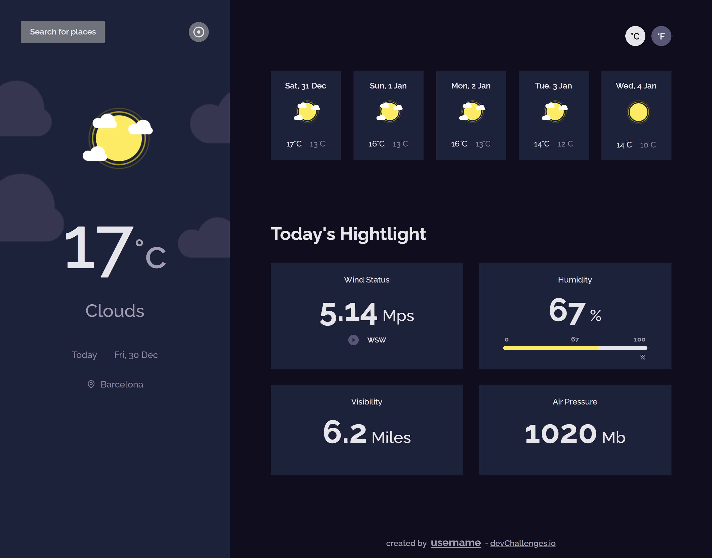

<h1 align="center">Weather Application</h1>

   Solution for a challenge from  <a href="http://devchallenges.io" target="_blank">Devchallenges.io</a>.

  <h3>
    <a href="https://dev-react-weather-application.netlify.app/">
      Demo
    </a>
     | 
    <a href="https://{your-url-to-the-solution}">
      Solution
    </a>
     | 
    <a href="https://devchallenges.io/challenges/mM1UIenRhK808W8qmLWv">
      Challenge
    </a>
  </h3>

<!-- OVERVIEW -->

## Overview

### User should be able to:

- View website layouts depending on their device's screen size
- See the weather 5days forecast
- Toggle to fahrenheit
- Search for other cities weather condition
- View the users location weather

### Built With

- [React](https://reactjs.org/)
- CSS Modules
- Vite

## Features

<!-- List the features of your application or follow the template. Don't share the figma file here :) -->

This application/site was created as a submission to a [DevChallenges](https://devchallenges.io/challenges) challenge. The [challenge](https://devchallenges.io/challenges/mM1UIenRhK808W8qmLWv) was to build an application to complete the given user stories.

## Contact

- GitHub [@shaj-ed](https://github.com/shaj-ed)
